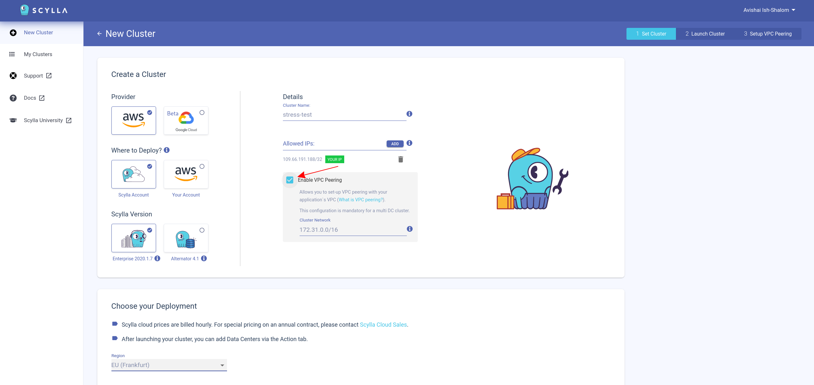
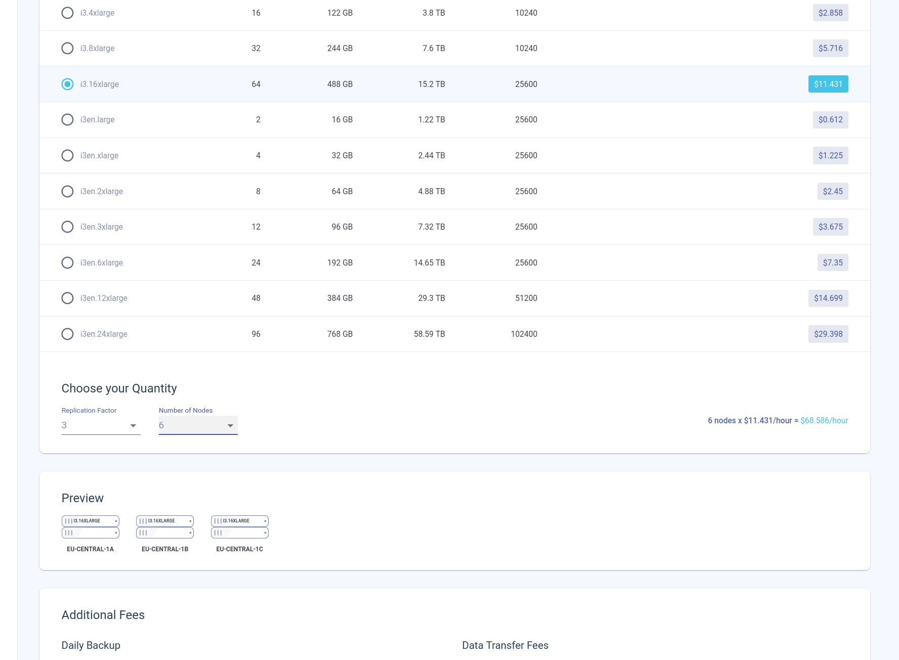
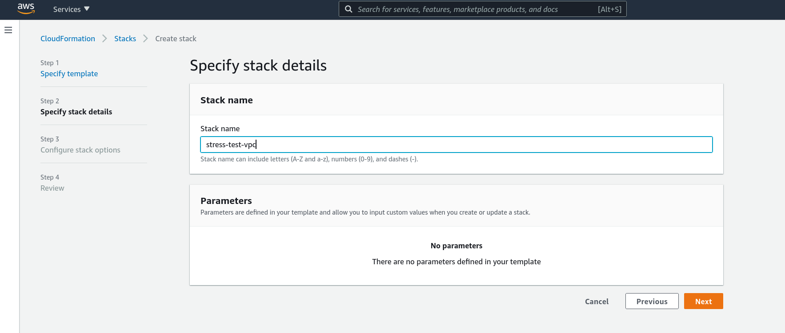
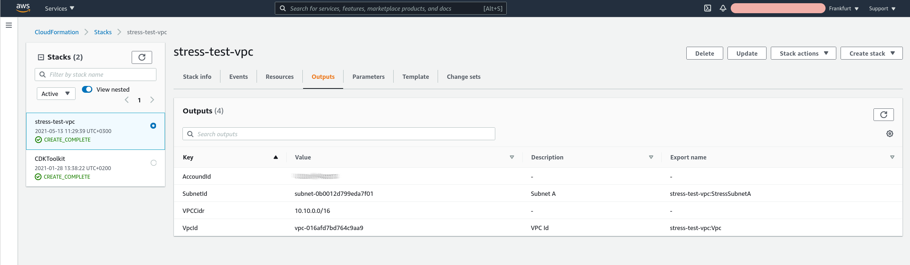
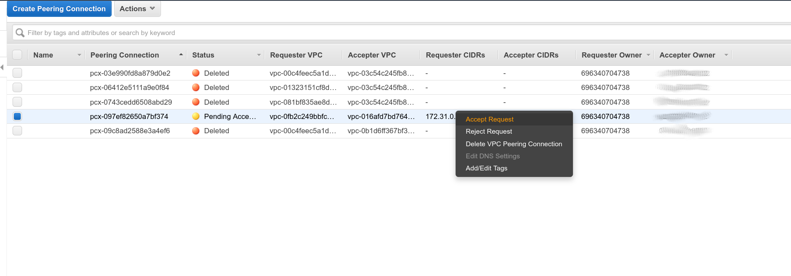
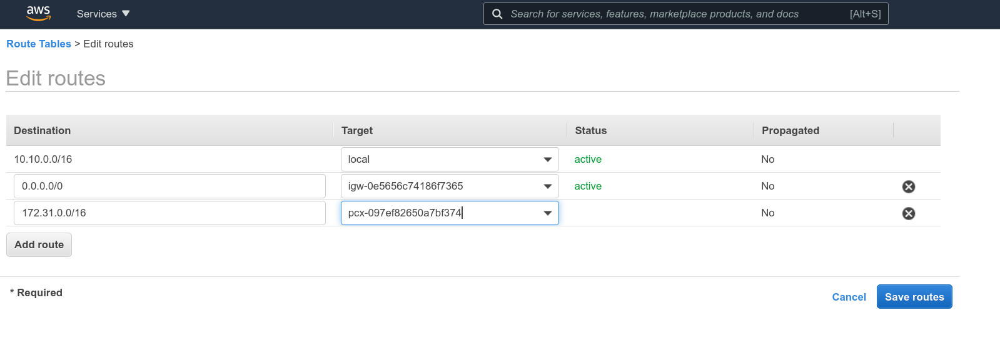
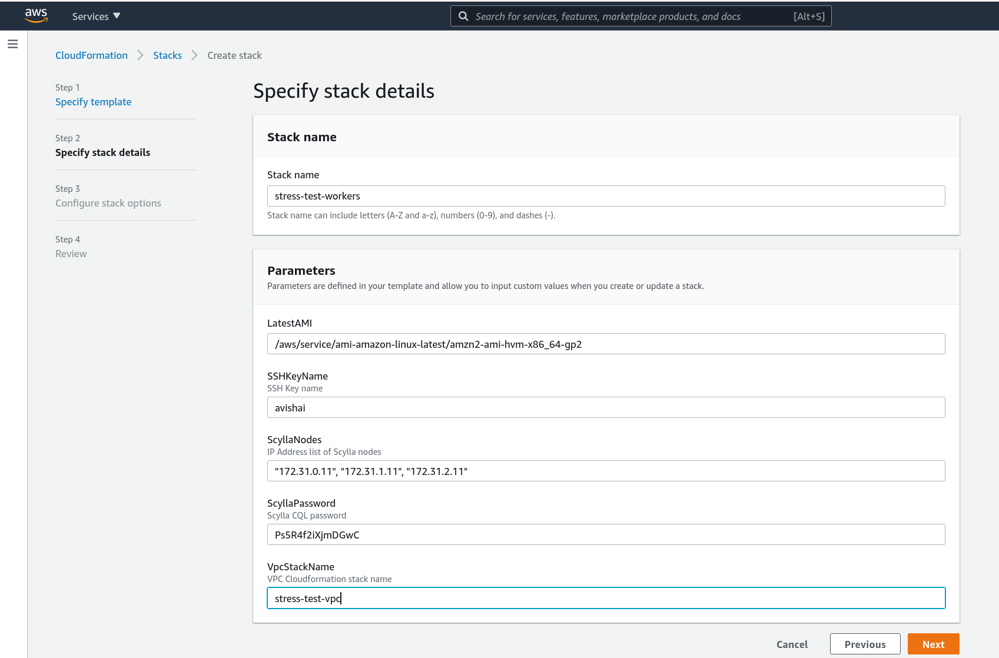

# Scylla load test demo
This repository contains CloudFormation templates and supporting files to run an automated load test on a Scylla Cloud cluster for demo purposes.

There are two CloudFormation templates:
1. VPC stack - VPC, subnet, routing table etc.
2. Workers stack - EC2 instances running the load test
In order to run the load test in a secure manner private VPC IP addresses are uses which means that VPC peering is required. VPC stack is separate so you can run it, peer it with Scylla cloud and then run the workers stack as needed to generate load.

# Running
## Scylla cloud
Run a new Scylla cloud cluster for the load test:


Select the node configuration suitable to the load - you may want to consult the [pricing and sizing calculator](https://www.scylladb.com/pricing/#pricing-calc) on the Scylla website.


While the cluster is bootstrapping, run the CloudFormation VPC stack as follows.

## VPC stack
The latest version of the templates is published to S3 and can be used instead of the version from this repo:
- [VPC stack](https://scylla-devrel.s3.us-east-2.amazonaws.com/assets/autostress/stress-vpc.cfn.yaml)
- [Workers stack](https://scylla-devrel.s3.us-east-2.amazonaws.com/assets/autostress/stress-workers.cfn.yaml)

Using the CLI:
```
aws cloudformation create-stack --stack-name test-stress-vpc --template-body file://./stress-vpc.cfn.yaml
```
Or using the S3 URL:
```
aws cloudformation create-stack --stack-name test-stress-vpc --template-url https://scylla-devrel.s3.us-east-2.amazonaws.com/assets/autostress/stress-vpc.cfn.yaml
```

Using the AWS web console, go to CloudFormation console and run a new stack:


When done, the stack will have outputs with the needed parameters for VPC peering with Scylla cloud: VPC ID, Account ID, VPC CIDR block.
Using the web console:


## VPC peering
Configure the peering as explained in Scylla cloud (also, see the [docs](https://docs.scylladb.com/scylla-cloud/cloud-setup/vpc-peering/)). Scylla cloud will initiate a VPC peering request you will need to accept - this can be done using the CLI:
```
aws ec2 accept-vpc-peering-connection --vpc-peering-connection-id pcx-XXXXXXXXXXXXXXXX
```

Or using the web console:


After accepting the VPC peering request you will need to add routes to Scylla cloud VPC through the peering connection. The load test VPC has a routing table named `ScyllaStressTest` to which the routes should be added. Using the CLI:
```
aws ec2 create-route --route-table-id rtb-XXXXXXXXXXXXXXXXXX --vpc-peering-connection-id pcx-XXXXXXXXXXXXXXXXXX --destination-cidr-block 172.31.0.0/16
```

Using the web console:


You are now ready to run the workers stack which will apply the load.
## Workers stack
Using the CLI (note the use of a [parameters file](https://aws.amazon.com/blogs/devops/passing-parameters-to-cloudformation-stacks-with-the-aws-cli-and-powershell/)):
```
aws cloudformation create-stack --stack-name test-scylla-workers --template-body file://./stress-workers.cfn.yaml --parameters file://./workers-params.json
```
Or using the S3 URL:
```
aws cloudformation create-stack --stack-name test-stress-workers --template-url https://scylla-devrel.s3.us-east-2.amazonaws.com/assets/autostress/stress-workers.cfn.yaml
```

Using the web console:


The stack requires the following parameters - other parameters are optional:
- `SSHKeyName` - SSH key already imported to EC2, used for SSH debugging access to workers
- `VPCStackName` - The name you used for the VPC stack, e.g. `test-stress-vpc`
- `ScyllaNodes` - A list of Scylla cloud nodes private IPs, copy pasted from the Scylla cloud "Connect" tab
- `ScyllaPassword` - The password of the `scylla` user, copy pasted from the Scylla cloud "Connect" tab

The stack will create 4 EC2 instances which will automatically start generating load on the cluster.